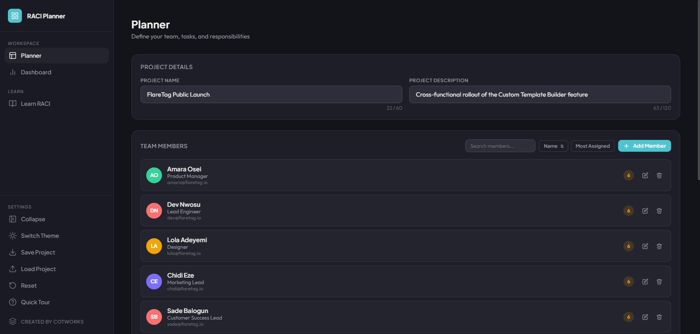

# RACI Planner

This is a complete team accountability tool built around the RACI framework (Responsible, Accountable, Consulted, Informed). You define your team and your tasks, assign each task's four roles per person, and it turns that into a live dashboard: KPIs, a filterable matrix, and a chart of who's carrying the load.

**[Live Demo](https://crypticot.github.io/raci-planner/)**



---

## Why this exists

RACI is a simple framework on paper, but most teams that try to use it end up with a static spreadsheet that gets filled in once and never opened again. Nobody notices when one person quietly ends up Accountable for eleven things, or when a task has no Accountable at all, until it's already a problem in a stand-up.

This tool treats the matrix as something you work inside of, not a document you produce once. Assigning people happens through live search right in the grid, tasks reorder by drag, and the moment something's off, like a task with two Accountable owners or nobody accountable at all, the tool tells you immediately instead of waiting for you to notice.

It also assumes the Dashboard is where the real decisions get made. Every name, every chart bar, every matrix chip is clickable and narrows the whole view down to that person, role, or status, so spotting an imbalance takes a click, not a pivot table.

---

## What it does

- **Team Members**: add members with a name, role, and contact; a badge shows each person's total assignment count, color-coded once it gets high; search by name, role, or contact; sort by name (a single icon cycles A–Z, Z–A, and back to unsorted) or by most assigned
- **Tasks**: add and rename tasks inline, reorder them by drag handle, and assign R/A/C/I per role through a live search box right in each cell; a warning appears if a task ends up with more than one Accountable, since RACI's one hard rule is exactly one owner per task; deleting a task asks for confirmation first
- **Excel-style table sorting**: click Task, Total, or Status to sort the task table, click again to reverse it, a third click clears it back to your manual drag order; sorting a second column adds it as a tiebreaker with a priority number shown on the header; sorting temporarily disables drag-reorder so you don't lose your place
- **Dashboard**: KPI cards for total tasks, total members, who's carrying the most assignments, and how many tasks are missing an Accountable; a full RACI matrix table, sortable by Task or Status; a stacked bar chart of assignments per member, split by role
- **Click-to-filter everywhere**: click a member's name, a chart bar, a legend entry, or a chip in the matrix, and the whole Dashboard, KPIs, matrix, and chart, narrows to that person or role; a dedicated status filter row does the same for Not Started, In Progress, Blocked, or Done; active filters show as removable chips, and combine freely
- **Export**: copy the matrix to your clipboard, download it as CSV or XLSX, or download the chart as PNG or PDF; every export respects whatever filters are currently active
- **Learn RACI**: a guided explainer that teaches the framework through one consistent worked example (the FlareTag Custom Template Builder launch), covering each role and the three most common ways RACI goes wrong; a "Load FlareTag Example" button populates the Planner with that exact team and matrix
- **Save Project**: export your full workspace as a JSON file
- **Persistent local storage**: your workspace saves automatically between sessions
- **Light and dark themes**, a collapsible sidebar, a guided onboarding tour for first-time users, and full mobile responsiveness with a bottom navigation bar

---

## Tech stack

Built entirely in vanilla HTML, CSS, and JavaScript. Just open `index.html`.

- [Chart.js](https://www.chartjs.org/): the stacked assignment chart
- [SortableJS](https://sortablejs.github.io/Sortable/): drag-to-reorder tasks
- [SheetJS](https://sheetjs.com/): XLSX export
- [jsPDF](https://github.com/parallax/jsPDF): chart PDF export
- Google Fonts: Plus Jakarta Sans (headings) + Outfit (body)

---

## Running it locally

```bash
git clone https://github.com/crypticot/raci-planner.git
cd raci-planner
```

Open `index.html` in any browser. No dependencies to install, no server required.

---

## A few design decisions worth knowing

**Why a second Accountable gets a warning instead of being blocked outright.** RACI's rule is one Accountable per task, but real work is messier than the framework, sometimes a task is genuinely co-owned during a handoff. Blocking it outright would force people to lie to the tool to get past a validation rule. Warning instead keeps the rule visible without pretending the tool knows their org better than they do.

**Why removing a member clears their assignments instead of being blocked.** People leave teams and roles change. If deleting a member were blocked while they had assignments, you'd never be able to remove someone without first manually hunting down and clearing every task they touched. The tool does that cleanup for you, but only after telling you exactly how many assignments will be cleared, so it's an informed choice, not a silent one.

**Why sorting the task table doesn't touch the underlying task order.** Tasks already have a meaningful sequence from drag-reordering, that's usually the order the team plans to tackle them in. A quick sort to find every Blocked task shouldn't quietly rewrite that sequence. Sorting is a temporary view; clearing it always returns you to the order you actually arranged.

**Why filtering happens by clicking things instead of dropdown menus.** The Dashboard's whole purpose is spotting patterns fast, a member with too much on their plate, a role nobody's covering. Making every one of those things directly clickable means noticing an imbalance and filtering down to inspect it is the same motion, not two.

---

## Built by

**Chidubem Ojukwu** · [Portfolio](https://crypticot.github.io/cotworks-portfolio/) · [LinkedIn](https://linkedin.com/in/ojukwuii)

Built as part of a learning project, and exists independently as a tool for anyone running a project who wants clear ownership without a spreadsheet nobody maintains.
